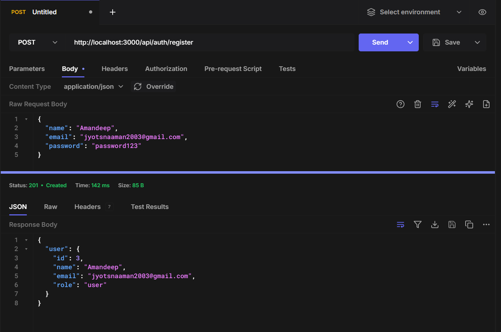
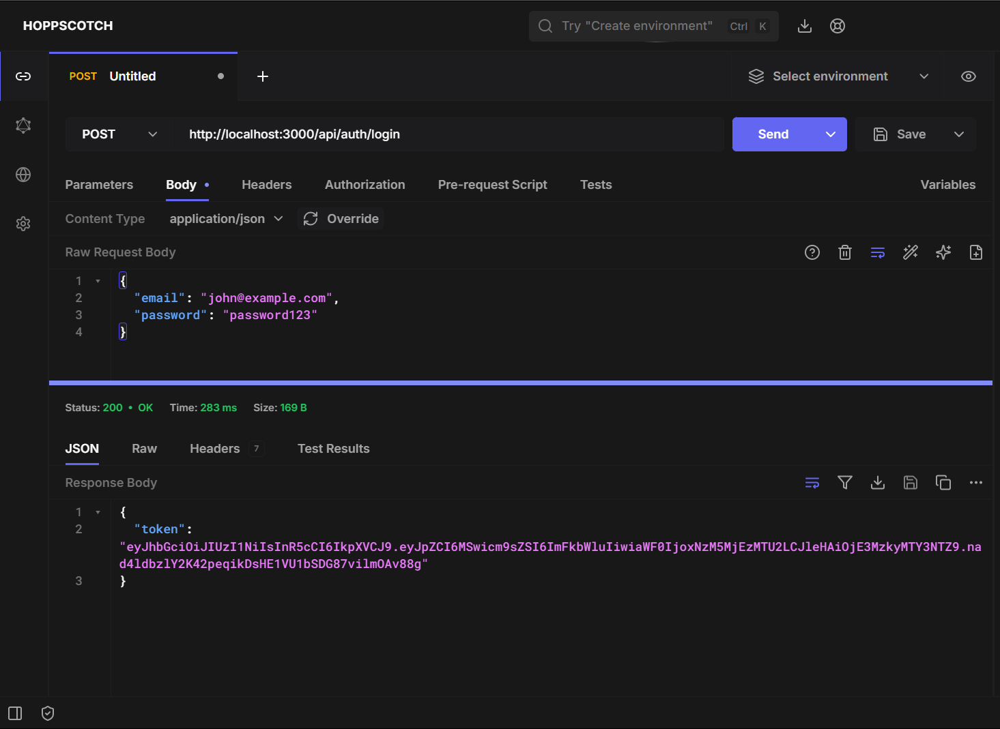
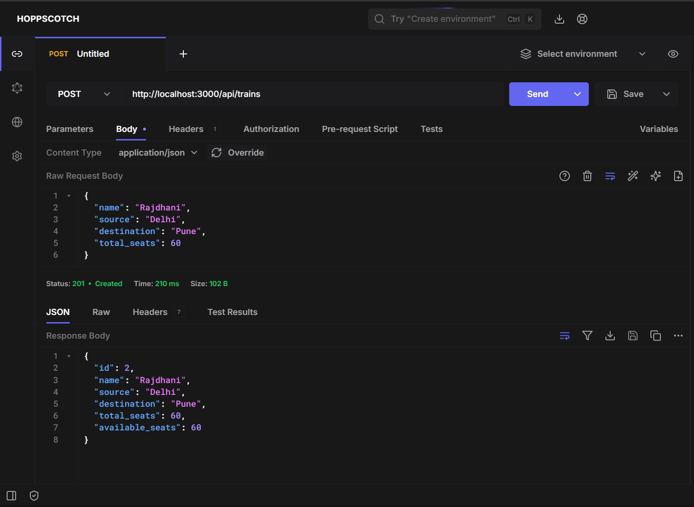
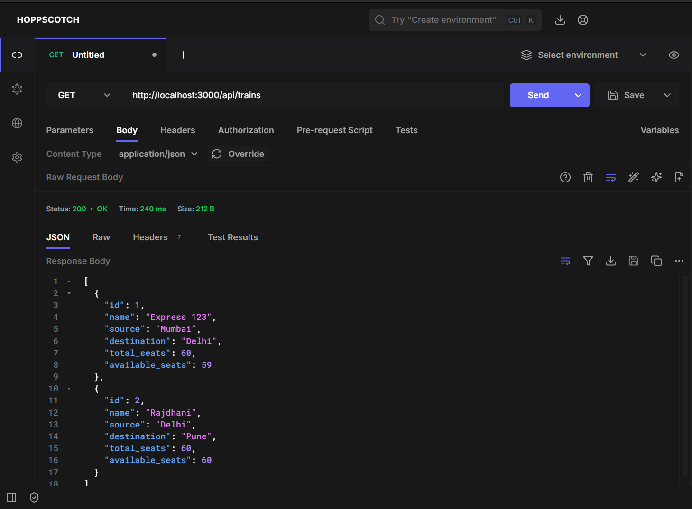
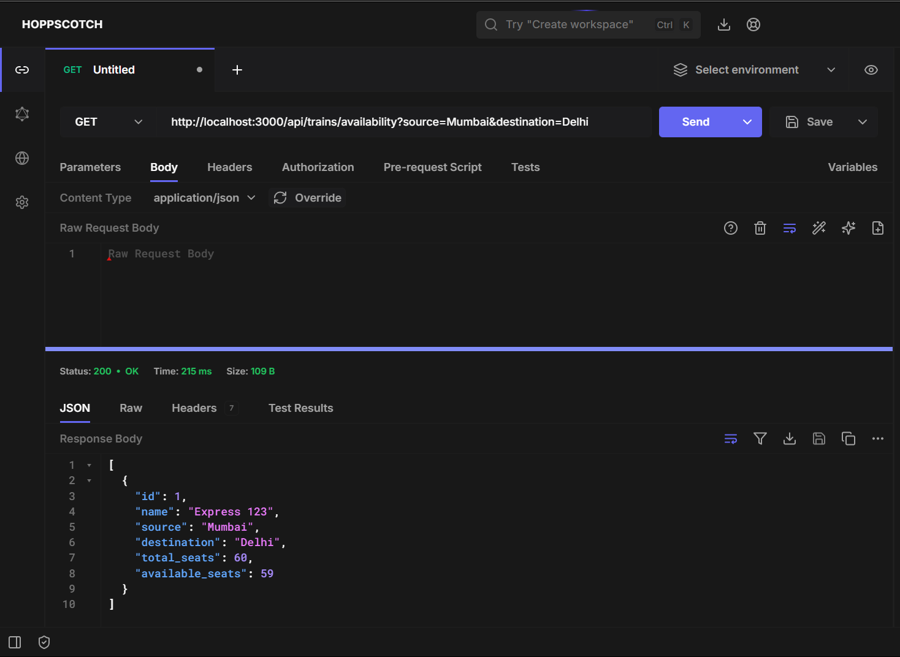
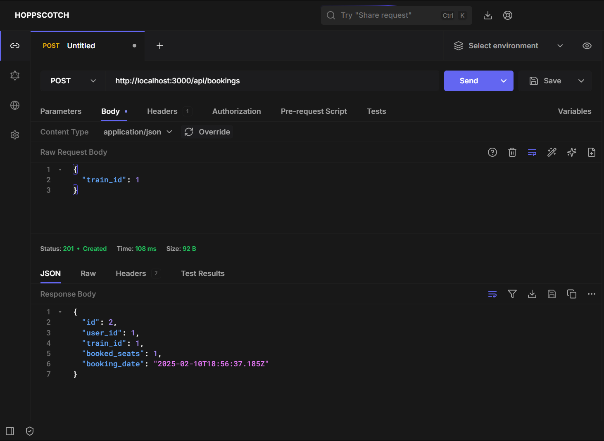
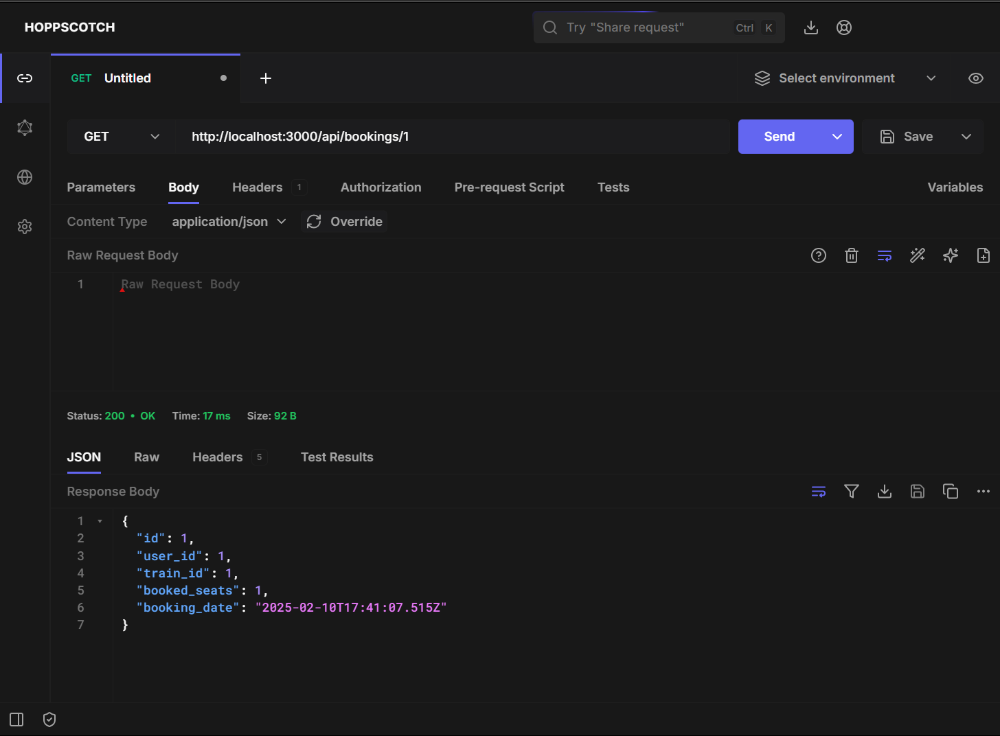
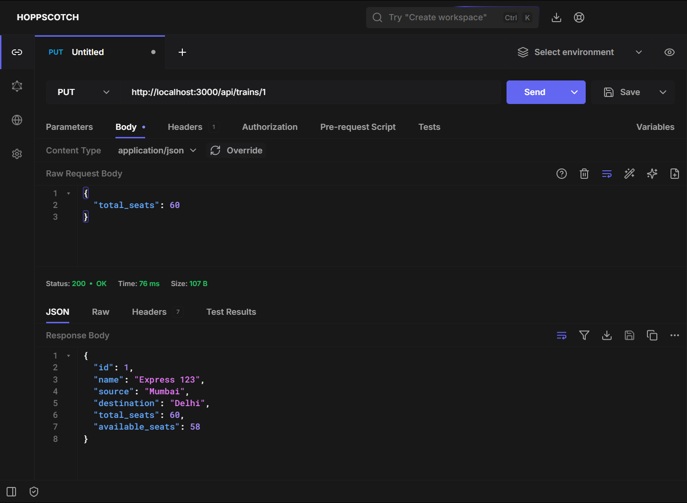

# Railway Management System

A Node.js/Express backend for railway ticket booking system with real-time seat availability and concurrency control.

## Features

- User registration/login
- Admin train management
- Seat availability checking
- Ticket booking with concurrency control
- Booking details retrieval

## Tech Stack

- Node.js
- Express.js
- PostgreSQL
- JWT Authentication

## Setup Instructions

### Installation

1. Clone the repository:

```
git clone https://github.com/yourusername/irctc-backend.git
```

2. Install dependencies:

```
    npm install
```

3. Database Setup:

```
    Create PostgreSQL database
    Run these SQL commands:

    CREATE TABLE users (
    id SERIAL PRIMARY KEY,
    name VARCHAR(255) NOT NULL,
    email VARCHAR(255) UNIQUE NOT NULL,
    password VARCHAR(255) NOT NULL,
    role VARCHAR(50) NOT NULL DEFAULT 'user' CHECK (role IN ('admin', 'user'))
    );

    CREATE TABLE trains (
    id SERIAL PRIMARY KEY,
    name VARCHAR(255) NOT NULL,
    source VARCHAR(255) NOT NULL,
    destination VARCHAR(255) NOT NULL,
    total_seats INTEGER NOT NULL,
    available_seats INTEGER NOT NULL CHECK (available_seats >= 0 AND available_seats <= total_seats)
    );

    CREATE TABLE bookings (
    id SERIAL PRIMARY KEY,
    user_id INTEGER REFERENCES users(id) ON DELETE CASCADE,
    train_id INTEGER REFERENCES trains(id) ON DELETE CASCADE,
    booked_seats INTEGER NOT NULL DEFAULT 1,
    booking_date TIMESTAMP NOT NULL DEFAULT CURRENT_TIMESTAMP
    );
```

4. Create .env file:

```
    PORT=3000
    DB_HOST=localhost
    DB_USER=postgres
    DB_PASSWORD=yourpassword
    DB_NAME=irctc
    JWT_SECRET=your_jwt_secret
    ADMIN_API_KEY=your_admin_api_key
```

5. Start the server:

```
    npm start
```

## Testing with Hoppscotch

### Register User:

    POST http://localhost:3000/api/auth/register
    Body: {
        "name": "John Doe",
        "email": "john@example.com",
        "password": "password123"
        }



### Login User

    POST http://localhost:3000/api/auth/login

    Body:

    {
    "email": "john@example.com",
    "password": "password123"
    }



### Add a New Train (Admin)

    POST http://localhost:3000/api/trains

    Headers:
        x-api-key: your_admin_api_key

    Body:
        {
        "name": "Express 123",
        "source": "Mumbai",
        "destination": "Delhi",
        "total_seats": 50
        }



### List All Trains

    GET http://localhost:3000/api/trains



### Get Seat Availability

    GET http://localhost:3000/api/trains/availability?source=Mumbai&destination=Delhi



### Book a Seat

    POST http://localhost:3000/api/bookings

    Headers:
        Authorization: Bearer <token_from_login>

    Body:
        {
        "train_id": 1
        }



### Get Booking Details

    GET http://localhost:3000/api/bookings/1

    Headers:
        Authorization: Bearer <token_from_login>



### Update Train Seats (Admin)

    PUT http://localhost:3000/api/trains/1

    Headers:
        x-api-key: your_admin_api_key

    Body:
        {
        "total_seats": 60
        }


